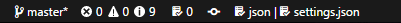
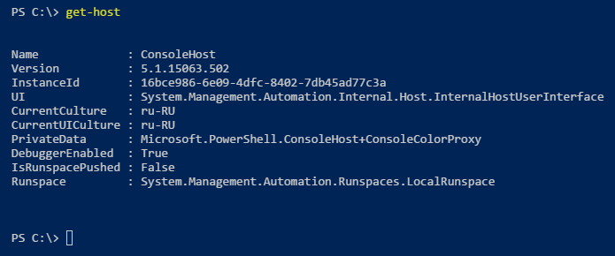

# Monokai from ST3
Fork Sublime's iconic Monokai Orig theme, and is the most beautiful themes for codding that I ever seen in my life.

[GitHub repository](https://github.com/TODO)

# CHANGELOG
[CHANGELOG.MD](CHANGELOG.md)

# History
Many years, I used for developing beautiful Sublime Text, different versions with Monokai theme. After I had started using vscode, I found that default syntax highlighting is little bit different from ST3. So, I developed this extension to fix it.

# Docs & Contribute  
To start using your extension with Visual Studio Code copy it into the `<user home>/.vscode/extensions` folder and restart Code. But I suggest you to use official Marketplace inside vscode. Go to [VS code Marketplace](https://TODO)

Yep, I can made a mistakes in code or this file and so on. I used to vscode for web developing, writing scripts (Bash, PowerShall) and some experiments with other languages. Sorry, but I can't check all programming languages in the world.

So, if you would have any comment or suggest or you find bugs, I would be happy received pull-request for you. Or, you can create issue and even send me email? and we try to find solutions.

# Tweaks
If you would like to play around with new colors, use the setting workbench.colorCustomizations to customize the currently selected theme.

Check my favorites customization examptle below, you can add this snippet in your "settings.json" file:

Nice black status bar, thanks to [acesmndr](https://stackoverflow.com/questions/42780975/visual-studio-code-status-bar-color):

```json
"workbench.colorCustomizations":{
  "statusBar.background" : "#1A1A1A",
  "statusBar.noFolderBackground" : "#212121",
  "statusBar.debuggingBackground": "#263238"
}
```


If you want return default status bar color:
```json
"workbench.colorCustomizations":{
  "statusBar.background" : "#007acc"
}
```


PowerShall colors for terminal:

```json
"workbench.colorCustomizations":{
  "terminal.background": "#012456"
}
```



# ScreenShot

TODO

**Enjoy!**